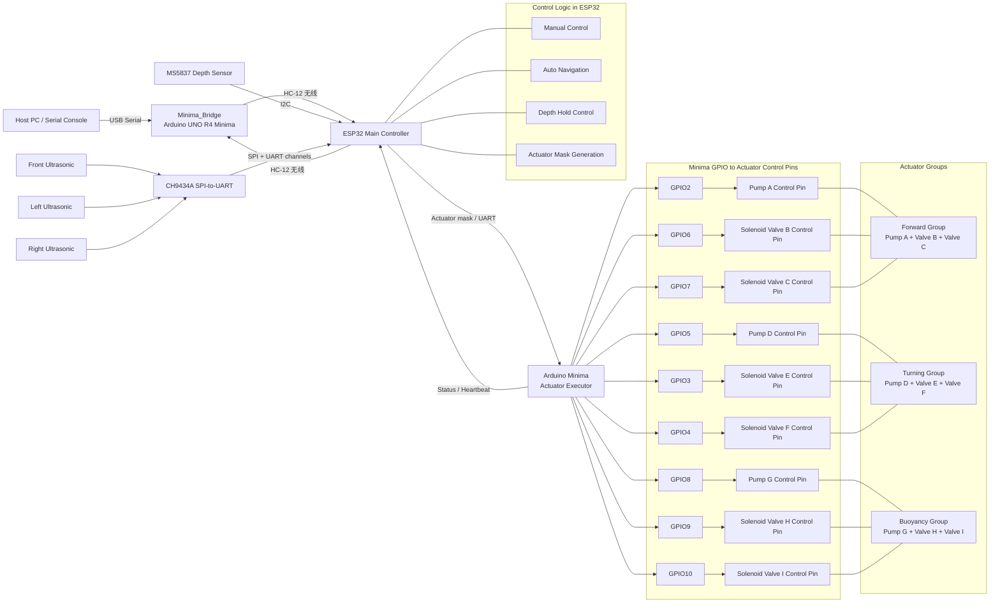

# Squid-Robot

双 MCU 水下机器人固件。

## 当前架构（V6）

- `ESP32/`
  主控。负责读取深度和超声波、做卡尔曼滤波、自动避障、深度控制、HC-12 无线接收、串口命令和 OTA。
- `Minima/`
  执行端。负责按位驱动气泵和电磁阀，不含任何逻辑。
- `Minima_Bridge/`
  HC-12 透传桥接端（Arduino UNO R4 Minima）。连接电脑，通过 HC-12 无线模块将电脑串口命令透传到机器人；支持双端信道配对。

## V6 版本变更

- **HC-12 无线遥控**：新增 HC-12 串口通道（ESP32 Serial2 IO1/IO2/IO47），电脑通过 `Minima_Bridge` 无线发送控制命令；
- **双端信道配对**：发送端发 `HC025` 切换本地信道，发送 `ESP025` 透传让机器人端切换信道；
- **网页 WiFi 配网**：OTA 新增 Captive Portal，30s 内未连接已知 WiFi 自动开启热点 `SquidRobot-Setup`，扫描并填写新 WiFi 后持久化保存；
- **水下 WiFi 管理**：启动时 3s 超声波预检测，水中跳过 WiFi；运行中检测到超声波读数自动关闭 WiFi；出水 30s 后自动重启重连；
- **CH9434A 启动容错**：SPI 初始化失败自动重试 5 次，全部失败则软复位 MCU；
- **前进阀切换间隔**：调整为 500 ms。

## 数据链路

1. `MS5837-02BA` 直接接到 `ESP32` 的 I2C。
2. `ESP32` 读取压力和温度，换算成水深，空气中自动以当前压力为零点。
3. `ESP32` 对深度做卡尔曼滤波，滤波后的深度和速度用于显示与定深控制。
4. 三路超声波通过 `CH9434A` 接到 `ESP32`。
5. `ESP32` 计算最终执行器掩码并通过有线串口发给 `Minima`。
6. `Minima` 只负责执行输出。
7. 电脑通过 `Minima_Bridge`（HC-12 无线）发送控制命令给 `ESP32`。

## System Block Diagram



## 关键接线

### MS5837 深度传感器

定义在 [ESP32/Protocol.h](ESP32/Protocol.h)：

- `DEPTH_I2C_ADDRESS = 0x76`
- `DEPTH_I2C_SDA = 4`
- `DEPTH_I2C_SCL = 5`
- `DEPTH_I2C_FREQ = 400000`

实际接线：

- `MS5837 SDA -> ESP32 IO4`
- `MS5837 SCL -> ESP32 IO5`
- `MS5837 VDD -> 3.3V`
- `MS5837 GND -> GND`

注意：

- 不要把 `SDA/SCL` 再接反。
- `MS5837` 需要 `3.3V`。
- I2C 上拉应拉到 `3.3V`，不要拉到 `5V`。

### 超声波传感器

通过 `CH9434A` 接入 `ESP32`：

- `UART1 -> Front`
- `UART2 -> Left`
- `UART0 -> Right`
- `UART3 -> Unused`

### HC-12 无线模块（机器人端）

定义在 [ESP32/Protocol.h](ESP32/Protocol.h)：

- `HC12_RX = IO1`
- `HC12_TX = IO2`
- `HC12_SET = IO47`
- 波特率：`9600 bps`

### HC-12 无线模块（桥接端）

定义在 [Minima_Bridge/Minima_Bridge.ino](Minima_Bridge/Minima_Bridge.ino)：

- `HC12_RX = D2`（SoftwareSerial）
- `HC12_TX = D3`（SoftwareSerial）
- `HC12_SET = D4`
- 波特率：`9600 bps`

### Minima 执行器引脚

定义见 [Minima/PinDefinitions.h](Minima/PinDefinitions.h)。

前进子系统：

- `PUMP_A = 2`
- `VALVE_B = 6`
- `VALVE_C = 7`

转向子系统：

- `PUMP_D = 5`
- `VALVE_E = 3`
- `VALVE_F = 4`

浮沉子系统：

- `PUMP_G = 8`
- `VALVE_H = 9`
- `VALVE_I = 10`

## 控制说明

### 有线串口

串口连接 `ESP32`，波特率 `115200`。

### 无线遥控（HC-12）

电脑通过 USB 连接 `Minima_Bridge`，打开串口监视器（波特率 `9600`），直接发送命令。

**信道配对命令：**

| 命令 | 作用 |
|------|------|
| `ESP025` | 让机器人端 HC-12 切换到信道 025（先执行此步）|
| `HC025`  | 让本地桥接端 HC-12 切换到信道 025（后执行此步）|

> 正确顺序：先发 `ESP025`，收到机器人回复后再发 `HC025`。

### 控制命令

- `q` 切换 `MANUAL / AUTO`
- `w` 前进
- `a` 左转
- `d` 右转
- `j` 上浮
- `k` 下潜
- `l<number>` 定深到指定厘米，例如 `l35`
- `s` 急停
- `c` 以当前压力重新校准深度零点
- `g` 打印当前传感器状态
- `v` 开关详细状态输出
- `h` 显示帮助

## OTA

`ESP32` 支持 ArduinoOTA 无线烧录。

**首次连接流程：**

1. 上电，等待 30s；若已知 WiFi 不可用，`ESP32` 自动开启热点 `SquidRobot-Setup`（无密码）；
2. 连接热点，打开任意网页，自动跳转配网页面；
3. 选择 WiFi 并输入密码，提交后凭据保存到 NVS；
4. 之后上电自动连接，无需重复配网。

**OTA 烧录：**

- 主机名：`squid-robot`
- OTA 密码：`12345678`

**水下保护：**

- 上电时若 3s 内检测到超声波读数（已在水中），跳过全部 WiFi 初始化；
- 入水后检测到超声波读数，自动关闭 WiFi；
- 出水后 30s 无超声波读数，自动重启重连 WiFi。

## Forward Control Notes

- The forward propulsion valves (Valve B + Valve C) toggle every `500 ms` during normal propulsion.
- On `stop()`, a balance phase begins: valves alternate every `500 ms` for `5000 ms` to equalize pressure and return the diaphragm to center.
- All forward timing is managed entirely by the `ESP32`; `Minima` only executes the actuator mask.

## Depth Hold Notes

- The `ESP32` samples `MS5837-02BA` every `50 ms`.
- Depth estimation now uses a three-state Kalman filter: depth, vertical speed, and vertical acceleration.
- The depth controller uses predictive braking and sends buoyancy direction plus PWM over UART to `Minima`.
- `Minima` keeps the forward and turn channels as digital outputs, and drives the buoyancy pump with software PWM.
- The buoyancy valves keep a `200 ms` minimum direction-change interval to avoid rapid valve chatter.

## 传感器输出

当前默认串口输出保留基础信息：

- `Depth`
- `Ultrasonic Front`
- `Ultrasonic Left`
- `Ultrasonic Right`

深度显示的是滤波后的厘米值；空气中默认深度为 `0 cm`。

## 构建

编译目标：

- `ESP32`: `esp32:esp32:esp32s3`
- `Minima`: `arduino:renesas_uno:minima`
- `Minima_Bridge`: `arduino:renesas_uno:minima`

示例：

```powershell
arduino-cli compile --fqbn esp32:esp32:esp32s3 .\ESP32
arduino-cli compile --fqbn arduino:renesas_uno:minima .\Minima
arduino-cli compile --fqbn arduino:renesas_uno:minima .\Minima_Bridge
```

> `ESP32/OtaConfig.local.h` 包含本地 WiFi 凭据，已加入 `.gitignore`，不会提交到版本库。首次克隆时需自行创建，参考 `ESP32/OtaConfig.h`。
