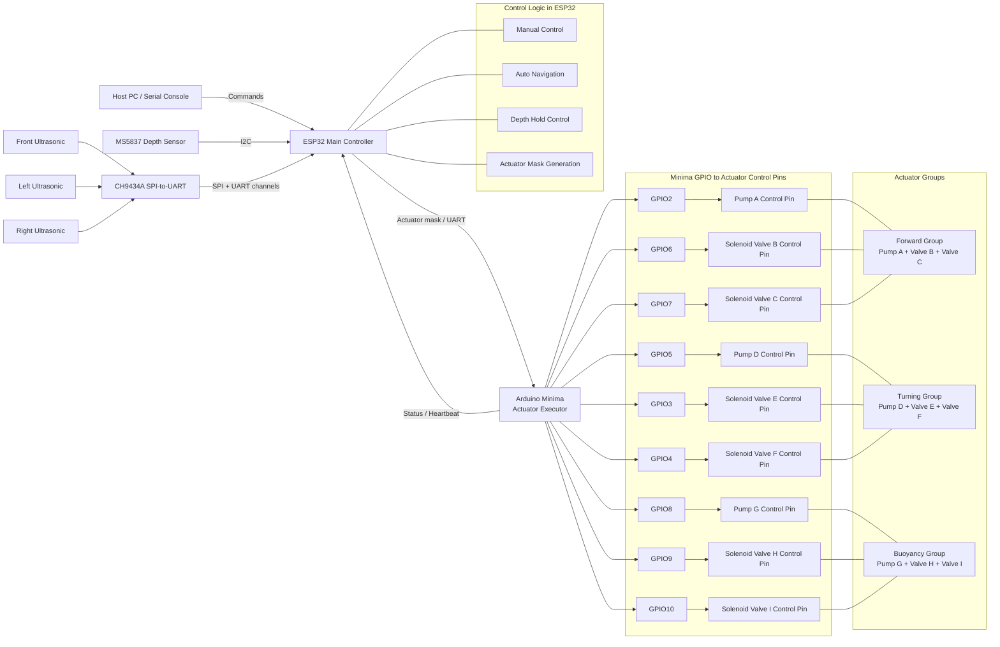

# Squid-Robot

双 MCU 水下机器人固件。

## 当前架构

- `ESP32/`
  主控。负责读取深度和超声波、做卡尔曼滤波、自动避障、深度控制、串口命令和 OTA。
- `Minima/`
  执行端。负责按位驱动气泵和电磁阀。

当前真实数据链路：

1. `MS5837-02BA` 直接接到 `ESP32` 的 I2C。
2. `ESP32` 读取压力和温度，换算成水深，并在空气中自动以当前压力为零点。
3. `ESP32` 对深度做卡尔曼滤波，滤波后的深度和速度用于显示与定深控制。
4. 三路超声波通过 `CH9434A` 接到 `ESP32`。
5. `ESP32` 计算最终执行器掩码并通过串口发给 `Minima`。
6. `Minima` 只负责执行输出。

## Depth Hold Notes

- The `ESP32` samples `MS5837-02BA` every `50 ms`.
- Depth estimation now uses a three-state Kalman filter: depth, vertical speed, and vertical acceleration.
- The depth controller uses predictive braking and sends buoyancy direction plus PWM over UART to `Minima`.
- `Minima` keeps the forward and turn channels as digital outputs, and drives the buoyancy pump with software PWM.
- The buoyancy valves keep a `200 ms` minimum direction-change interval to avoid rapid valve chatter.

## System Block Diagram



## 关键接线

### MS5837 深度传感器

这一组定义已经固定在 [ESP32/Protocol.h](/D:/working/squid%20robot/code/receiver/ESP32/Protocol.h)：

- `DEPTH_I2C_ADDRESS = 0x76`
- `DEPTH_I2C_SDA = 4`
- `DEPTH_I2C_SCL = 5`
- `DEPTH_I2C_FREQ = 400000`

实际接线：

- `MS5837 SDA -> ESP32 IO4`
- `MS5837 SCL -> ESP32 IO5`
- `MS5837 VDD -> 3.3V`
- `MS5837 GND -> GND`

注意：

- 不要把 `SDA/SCL` 再接反。
- `MS5837` 需要 `3.3V`。
- I2C 上拉应拉到 `3.3V`，不要拉到 `5V`。

### 超声波传感器

通过 `CH9434A` 接入 `ESP32`：

- `UART1 -> Front`
- `UART2 -> Left`
- `UART0 -> Right`
- `UART3 -> Unused`

### Minima 执行器引脚

定义见 [Minima/PinDefinitions.h](/D:/working/squid%20robot/code/receiver/Minima/PinDefinitions.h)。

前进子系统：

- `PUMP_A = 2`
- `VALVE_B = 6`
- `VALVE_C = 7`

转向子系统：

- `PUMP_D = 5`
- `VALVE_E = 3`
- `VALVE_F = 4`

浮沉子系统：

- `PUMP_G = 8`
- `VALVE_H = 9`
- `VALVE_I = 10`

## 控制说明

串口连接 `ESP32`，波特率 `115200`。

常用命令：

- `q` 切换 `MANUAL / AUTO`
- `w` 前进
- `a` 左转
- `d` 右转
- `j` 上浮
- `k` 下潜
- `l<number>` 定深到指定厘米，例如 `l35`
- `s` 急停
- `c` 以当前压力重新校准深度零点
- `g` 打印当前传感器状态
- `v` 开关详细状态输出
- `h` 显示帮助

## 传感器输出

当前默认串口输出保留基础信息：

- `Depth`
- `Ultrasonic Front`
- `Ultrasonic Left`
- `Ultrasonic Right`

深度显示的是滤波后的厘米值；空气中默认深度为 `0 cm`。

## 构建

编译目标：

- `ESP32`: `esp32:esp32:esp32s3`
- `Minima`: `arduino:renesas_uno:minima`

示例：

```powershell
arduino-cli compile --fqbn esp32:esp32:esp32s3 .\ESP32
arduino-cli compile --fqbn arduino:renesas_uno:minima .\Minima
```

## OTA

`ESP32` 支持 OTA。首次需要 USB 烧录，之后可以继续通过网络更新 `ESP32` 固件。`Minima` 仍通过 USB 烧录。
