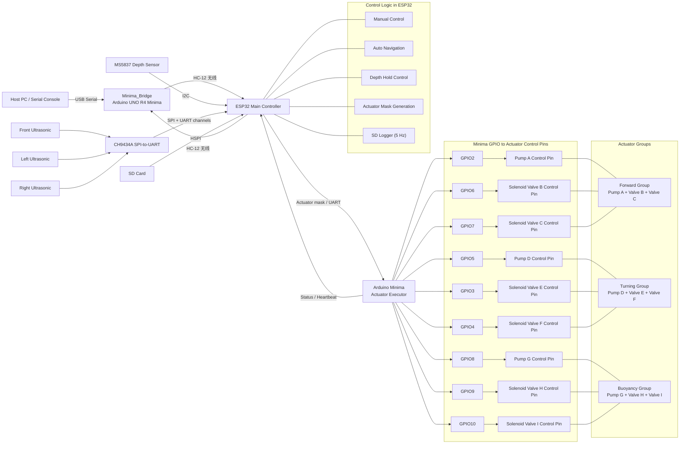

# Squid-Robot

双 MCU 水下机器人固件。

## 当前架构（V7）

- `ESP32/`
  主控。负责读取深度和超声波、做卡尔曼滤波、自动避障、深度控制、HC-12 无线接收、SD 卡数据记录、串口命令和 OTA。
- `Minima/`
  执行端。负责按位驱动气泵和电磁阀，不含任何逻辑。
- `Minima_Bridge/`
  HC-12 透传桥接端（Arduino UNO R4 Minima）。连接电脑，通过 HC-12 无线模块将电脑串口命令透传到机器人；支持双端信道配对。

## V7 版本变更

- **DEBUG / TEST 双模式**：开机默认 DEBUG 模式（WiFi 开、网页控制台可用）；三路超声波同时有效并持续 10 秒后自动进入 TEST 模式（WiFi 关、SD 记录启动）；三路全部失效持续 10 秒自动退回 DEBUG；`mt` / `md` 命令手动切换；
- **SD 卡数据记录**：进入 TEST 模式时按 NTP 时间戳建文件夹，记录：
  - `sensors.csv` — 深度 / 速度 / 加速度 / 三路超声波 / 运动状态 / 电池电压（5 Hz）
  - `commands.csv` — 所有收到的命令（来源：serial / hc12 / web）
  - `events.log` — 系统事件（模式切换、急停、mark 标记等）
  - 文件夹名碰撞自动追加后缀（`_1`/`_2`...），绝不覆盖历史 session；
  - `sensors.csv` 保持打开，每 5 行（1 秒）flush 一次，断电最多丢 1 秒数据；
- **浏览器统一控制台**（`http://<IP>/console`）：
  - 上半部分：SD 文件管理（浏览、下载、批量勾选、ZIP 打包下载文件夹、上传、递归删除）
  - 下半部分：实时串口控制台（250ms 轮询，按字节 pos 前进，中文不漂移）
  - 纯 HTTP，手机 / 电脑 / 平板浏览器直接打开，零安装；
- **OTA 配网改为纯网页配网**：不再依赖硬编码 SSID，上电后优先尝试 NVS 保存的 WiFi（10s），失败则开启 `SquidRobot-Setup` 热点；
- **j/k 浮沉命令改为切换式（toggle）**：同向再按停止，异向直接切换；
- **浮沉 s 急停新增气压平衡**（E/F 同时交替开关，500ms/5s）；
- **前进阀切换间隔调整为 1s**；
- **删除 Python FTP 工具**（`Tools/FTPBrowser`）——已被浏览器控制台完全替代；
- **删除 `Test_GPIO/`**。

## 数据链路

1. `MS5837-02BA` 直接接到 `ESP32` 的 I2C。
2. `ESP32` 读取压力和温度，换算成水深，空气中自动以当前压力为零点。
3. `ESP32` 对深度做卡尔曼滤波，滤波后的深度和速度用于显示与定深控制。
4. 三路超声波通过 `CH9434A` 接到 `ESP32`。
5. `ESP32` 计算最终执行器掩码并通过有线串口发给 `Minima`。
6. `Minima` 只负责执行输出。
7. 电脑通过 `Minima_Bridge`（HC-12 无线）发送控制命令给 `ESP32`。

## System Block Diagram



## 关键接线

### MS5837 深度传感器

定义在 [ESP32/Protocol.h](ESP32/Protocol.h)：

- `DEPTH_I2C_ADDRESS = 0x76`
- `DEPTH_I2C_SDA = 4`
- `DEPTH_I2C_SCL = 5`
- `DEPTH_I2C_FREQ = 400000`

实际接线：

- `MS5837 SDA -> ESP32 IO4`
- `MS5837 SCL -> ESP32 IO5`
- `MS5837 VDD -> 3.3V`
- `MS5837 GND -> GND`

注意：

- 不要把 `SDA/SCL` 再接反。
- `MS5837` 需要 `3.3V`。
- I2C 上拉应拉到 `3.3V`，不要拉到 `5V`。

### 超声波传感器

通过 `CH9434A` 接入 `ESP32`：

- `UART1 -> Front`
- `UART2 -> Left`
- `UART0 -> Right`
- `UART3 -> Unused`

### SD 卡（SPI3/HSPI，独立总线）

定义在 [ESP32/Protocol.h](ESP32/Protocol.h)：

- `SD_SPI_MOSI = IO6`
- `SD_SPI_MISO = IO7`
- `SD_SPI_SCK  = IO8`
- `SD_SPI_CS   = IO14`

SD 卡使用独立 HSPI 总线，与 CH9434A 的 VSPI 不共享。FAT32 格式化。

### HC-12 无线模块（机器人端）

定义在 [ESP32/Protocol.h](ESP32/Protocol.h)：

- `HC12_RX = IO1`
- `HC12_TX = IO2`
- `HC12_SET = IO47`
- 波特率：`9600 bps`

### HC-12 无线模块（桥接端）

定义在 [Minima_Bridge/Minima_Bridge.ino](Minima_Bridge/Minima_Bridge.ino)：

- `HC12_RX = D2`（SoftwareSerial）
- `HC12_TX = D3`（SoftwareSerial）
- `HC12_SET = D4`
- 波特率：`9600 bps`

### Minima 执行器引脚

定义见 [Minima/PinDefinitions.h](Minima/PinDefinitions.h)。

前进子系统：

- `PUMP_A = 2`
- `VALVE_B = 6`
- `VALVE_C = 7`

转向子系统：

- `PUMP_D = 5`
- `VALVE_E = 3`
- `VALVE_F = 4`

浮沉子系统：

- `PUMP_G = 8`
- `VALVE_H = 9`
- `VALVE_I = 10`

## 运行模式

### DEBUG 模式（默认）

- WiFi 开启，HTTP 服务可用
- 浏览器打开 `http://<IP>/console` 查看文件和串口
- OTA 固件更新可用
- SD 卡不记录

### TEST 模式

进入条件（任一）：
- **自动**：三路超声波同时有效 ≥ 10 秒（入水检测）
- **手动**：发送 `mt` 命令（不受出水超时自动退出）

退出条件（任一）：
- **自动**：三路超声波全部失效 ≥ 10 秒（出水检测，仅自动进入时生效）
- **手动**：发送 `md` 命令

进入时：
- WiFi 关闭（省电 + 减少水下干扰）
- SD 卡以 NTP 时间戳建文件夹，开始 5 Hz 记录
- 串口切回 USB（无 WebConsole）

退出时：
- SD flush + close（数据安全落盘）
- WiFi 重新启动，Web 控制台恢复

## 控制命令

### 有线串口

串口连接 `ESP32`，波特率 `115200`。

### 无线遥控（HC-12）

电脑通过 USB 连接 `Minima_Bridge`，打开串口监视器（波特率 `9600`），直接发送命令。

**信道配对命令：**

| 命令 | 作用 |
|------|------|
| `ESP025` | 让机器人端 HC-12 切换到信道 025（先执行此步）|
| `HC025`  | 让本地桥接端 HC-12 切换到信道 025（后执行此步）|

> 正确顺序：先发 `ESP025`，收到机器人回复后再发 `HC025`。

### 命令列表

| 命令 | 说明 |
|------|------|
| `w` / `forward` | 前进 |
| `a` / `left` | 左转 |
| `d` / `right` | 右转 |
| `j` / `ascend` | 上浮（toggle：再按停止） |
| `k` / `descend` | 下潜（toggle：再按停止） |
| `l<N>` | 定深到 N 厘米，例如 `l35` |
| `s` / `stop` | 急停（含气压平衡） |
| `c` / `calibrate` | 以当前压力重新校准深度零点 |
| `g` / `sensors` | 打印当前传感器状态 |
| `v` / `verbose` | 开关详细状态输出 |
| `q` | 切换 MANUAL / AUTO |
| `mt` | 手动进入 TEST 模式 |
| `md` | 手动进入 DEBUG 模式 |
| `stat` | 打印 SD 卡 session 状态和文件大小 |
| `mark [note]` | 在 events.log 中插入标记 |
| `h` / `help` | 显示帮助 |

## 浏览器控制台

DEBUG 模式下，浏览器打开 `http://<IP>/console`。

**文件管理（上半部分）：**

- 浏览 SD 卡目录结构
- 勾选框批量选择文件/文件夹
- 单文件直接下载；多选或文件夹自动 ZIP 打包下载（需浏览器能访问 cdnjs）
- 上传文件（支持多选）
- 递归删除（可删非空文件夹）

**串口控制台（下半部分）：**

- 250ms 轮询，实时显示 ESP32 串口输出
- 输入框发送命令（本地回显 `> cmd`）
- 中文正确显示（按字节追踪 pos，不依赖 JS string.length）

**HTTP API（供自定义工具使用）：**

| 方法 | 路径 | 说明 |
|------|------|------|
| `GET` | `/files?path=/` | 列出目录，返回 JSON |
| `GET` | `/file?path=/x/y` | 下载文件 |
| `POST` | `/upload?path=/dir` | multipart/form-data 上传 |
| `DELETE` | `/file?path=/x/y` | 递归删除文件或目录 |
| `GET` | `/log?p=<pos>` | 获取串口日志（pos 之后的部分） |
| `POST` | `/cmd` | 发送命令（body 为纯文本） |

## OTA

`ESP32` 支持 ArduinoOTA 无线烧录。

**首次连接流程：**

1. 上电，等待 10s 尝试连接 NVS 保存的 WiFi；
2. 若失败，自动开启热点 `SquidRobot-Setup`（无密码）；
3. 连接热点，打开任意网页，自动跳转配网页面；
4. 选择 WiFi 并输入密码，提交后凭据保存到 NVS；
5. 之后上电自动连接，无需重复配网。

**OTA 烧录：**

- 主机名：`squid-robot`
- OTA 密码：`12345678`

## SD 数据可靠性

- `sensors.csv` 保持打开，每 5 行（1 秒）调用 `flush()` 同步 FAT 元数据；
- `commands.csv` / `events.log` 每次写入后立即 `close()`；
- 正常退出（`md` 或自动出水）：`endSession()` 强制 `flush + close`，**0 行丢失**；
- 异常断电 / 崩溃：最多丢失 **≤ 5 行 = 1 秒** 的 `sensors.csv` 尾部数据；
- 文件夹名冲突自动追加 `_1` / `_2` ...，**绝不覆盖历史 session**；
- SD 使用独立 HSPI 总线（IO6/7/8/14），不与 CH9434A 的 VSPI 冲突。

## Forward Control Notes

- The forward propulsion valves (Valve B + Valve C) toggle every `1000 ms` during normal propulsion.
- On `stop()`, a balance phase begins: valves alternate every `500 ms` for `5000 ms` to equalize pressure and return the diaphragm to center.
- All forward timing is managed entirely by the `ESP32`; `Minima` only executes the actuator mask.

## Depth Hold Notes

- The `ESP32` samples `MS5837-02BA` every `50 ms`.
- Depth estimation now uses a three-state Kalman filter: depth, vertical speed, and vertical acceleration.
- The depth controller uses predictive braking and sends buoyancy direction plus PWM over UART to `Minima`.
- `Minima` keeps the forward and turn channels as digital outputs, and drives the buoyancy pump with software PWM.
- The buoyancy valves keep a `200 ms` minimum direction-change interval to avoid rapid valve chatter.

## 传感器输出

当前默认串口输出保留基础信息：

- `Depth`
- `Ultrasonic Front`
- `Ultrasonic Left`
- `Ultrasonic Right`

深度显示的是滤波后的厘米值；空气中默认深度为 `0 cm`。

## 构建

编译目标：

- `ESP32`: `esp32:esp32:esp32s3`
- `Minima`: `arduino:renesas_uno:minima`
- `Minima_Bridge`: `arduino:renesas_uno:minima`

示例：

```powershell
arduino-cli compile --fqbn esp32:esp32:esp32s3 .\ESP32
arduino-cli compile --fqbn arduino:renesas_uno:minima .\Minima
arduino-cli compile --fqbn arduino:renesas_uno:minima .\Minima_Bridge
```

> `ESP32/OtaConfig.local.h` 包含本地 WiFi 凭据，已加入 `.gitignore`，不会提交到版本库。首次克隆时需自行创建，参考 `ESP32/OtaConfig.h`。
